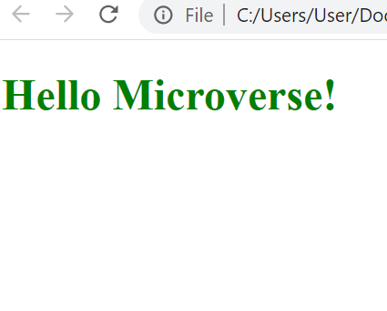

# Hello-Microcerse

> This is our fist week and the first project in github. 
> We will use html and css files in this project. Also we will use .gitignore file for ignore some files during commit

## Built With

- HTML
- CSS

## Getting Started

To get a local copy up and running follow these simple example steps.

### Setup

Make shure that all files in the same directory

Open main.html file.

👤 **Author**

- GitHub: [@elmar8287](https://github.com/elmar8287)

## Show your support

Give a ⭐️ if you like this project!
